# Smart Cycle Dashboard: IoT Health & Navigation System

## 🚲 Project Overview
The Smart Cycle Dashboard is an ESP32-based retrofittable module designed to modernize traditional bicycles. It integrates **biometric health monitoring** with **active safety features**, bridging the gap between fitness trackers and vehicle avionics.

The system utilizes an **MPU6050 Gyroscope** to detect the cyclist's lean angle, automatically triggering turn indicators without manual signaling—significantly improving rider safety in traffic.

## 🌟 Key Features
* **Auto-Turn Indicators:** 3-axis accelerometer detects lean >15° to activate Left/Right LEDs automatically.
* **Biometric Tracking:** Real-time Heart Rate (Pulse Sensor) and Ambient Temperature (DHT11/22) monitoring.
* **Dual-Interface Display:**
    * **Local:** 16x2 LCD mounted on the handlebars for immediate stats.
    * **Remote:** Bluetooth (BLE) transmission to the **Blynk Mobile App** for data logging.

## 🛠 Hardware Tech Stack
* **Microcontroller:** ESP32 (Selected for built-in Bluetooth & Wi-Fi capabilities).
* **Sensors:**
    * **MPU6050:** 6-Axis Accelerometer & Gyroscope (Tilt Detection).
    * **Pulse Sensor:** Optical Heart Rate monitor.
    * **DHT11:** Temperature Sensor.
* **Actuators:** LED Indicators, 16x2 LCD (I2C).
* **Power:** Rechargeable Li-Ion Battery Pack.

## 📐 System Architecture

## 🧠 Smart Logic Flow
The core innovation is the Tilt-Detection Algorithm that replaces manual hand signals.

```mermaid

    flowchart TD

    Start((Start Ride)) --> ReadSensors[Read MPU6050 & Pulse]
    ReadSensors --> CheckTilt{Check Lean Angle}
    
    CheckTilt -->|Lean Left > 15°| BlinkL[Blink Left LED]
    CheckTilt -->|Lean Right > 15°| BlinkR[Blink Right LED]
    CheckTilt -->|Stable| NoSignal[LEDs OFF]
    
    BlinkL --> UpdateDisplay[Update LCD & App]
    BlinkR --> UpdateDisplay
    NoSignal --> UpdateDisplay
    
    UpdateDisplay --> CheckPulse{Heart Rate High?}
    CheckPulse -->|Yes| Alert[Flash Warning on LCD]
    CheckPulse -->|No| Loop[Continue Loop]
```

## 🚀 Future Roadmap
* **Crash Detection:** Using the accelerometer to detect sudden G-force spikes (impact) and triggering an SOS call.
* **Energy Harvesting:** Solar panel integration for self-charging capability.
* **GPS Navigation:** Integration of NEO-6M module for turn-by-turn navigation on the LCD.

## 📂 Documentation
*Smart_Cycle_Dashboard_Report.pdf:* Detailed project report.
*opto_project.pptx:* Presentation slides and component cost breakdown.

## 👤 Author
**Kesava Satish Boppana**
